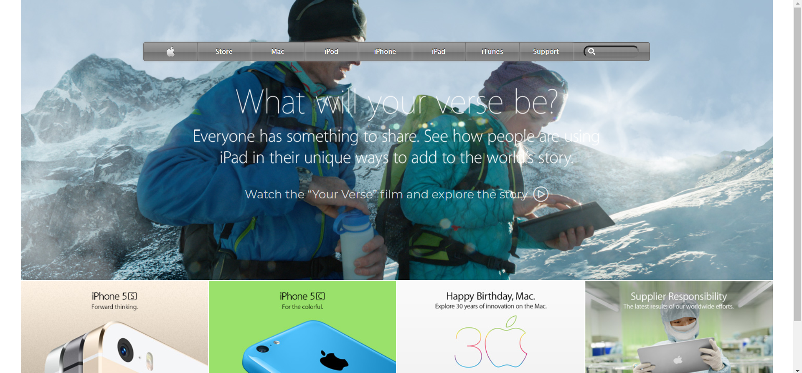

# PROJECT: POSITIONING AND FLOATING ELEMENTS
Hello! **I'm Alexander Nitiola** and this is my **Project: Building with Backgrounds and Gradients** from the 
curriculum of The Odin Project's [Curriculum.](https://www.theodinproject.com/courses?ref=homenav)

## Screenshot of My Work

## Notes
- Instructions: [PROJECT: BUILDING WITH BACKGROUNDS AND GRADIENTS](https://theodinproject.com/courses/html-and-css/lessons/building-with-backgrounds-and-gradients)

- You can see my project through this link: [View in Browser](https://thecre8tor.github.io/apple_old_website/)  
**RESPONSIVE: 
Not Responsive**

- Click [here](https://web.archive.org/web/20140301004610/http://www.apple.com/) to visit The New York Times original page.

## What i Learned
* I gained more experience on how to use CSS Flexbox & Advance Positioning.
* My CSS skill improved much more.
* I Got the chance to work with CSS Gradient and Background.
* I improved more on how to structure my HTML Document properly.

## I was able to build this website with:
* Flexbox
* CSS Advance Positioning